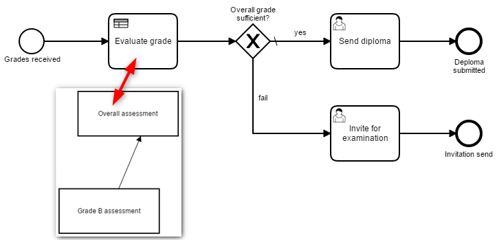

# Camunda Examples

## Examples

| Scenario | Image |
|--- | --- |
| **Model References**  [model-references](model-references) shows how models such as BPMN, DMN and CMMN can be linked.  ✔ Business Rule Task ✔ Call Activity |  |

#### Sub-Module Heroku Deployment

Since this repository consists of several sub-modules and a Maven parent, the Heroku GitHub deployment would be slightly different:
1. Fork this repository
2. Connect your Heroku-Account to your GitHub-Account
3. Create a new app and choose under *Deploy* the forked repository
4. Add the following two **Config Vars** under *Settings*:
   1. `MAVEN_CUSTOM_OPTS` = `-pl xyz-submodule-path`
   2. `PATH_TO_PROJECT` = `xyz-submodule-path`
5. Deploy the app