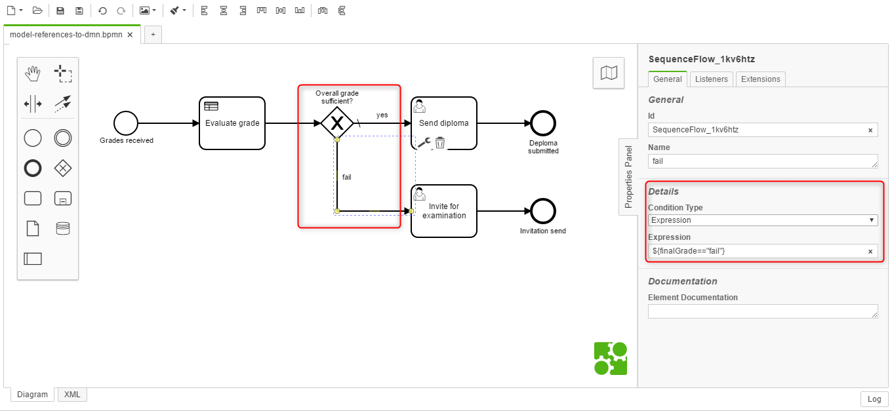

# Example: Model References

This project shows how models such as BPMN, DMN and CMMN can be linked.

✔ Business Rule Task ✔ Call Activity

**Contents:**

- [BPMN linking DMN](#bpmn-linking-dmn)
    - [Scenario](#scenario)
    - [Modelling of DRD and Decision Tables](#modelling-of-drd-and-decision-tables)
    - [Modelling and Linking of BPMN and DMN](#modelling-and-linking-of-bpmn-and-dmn)
- [BPMN calling BPMN](#bpmn-calling-bpmn)
    - [Called BPMN](#called-bpmn)
    - [Caller BPMN](#caller-bpmn)
- [BPMN calling CMMN](#bpmn-calling-cmmn)
    - [Called CMMN](#called-cmmn)
    - [Caller BPMN](#caller-bpmn)
- [Maintainer](#maintainer)
- [License](#license)

## BPMN linking DMN

The following example shows how a DMN model, containing a DRD and two decision tables, can be called a business rule task.

### Scenario

We have a fictive process where an overall grade needs to be assessed, and a decision is made whether the overall grade is sufficient or not. The assessment will be done using two grades A and B, where B consists of two sub-grades part 1 and 2. All grades are based on the Swiss grading scheme.

### Modelling of DRD and Decision Tables

The scenario mentioned above is realized using two decision tables. The association is modelled using DRD:

Decision table one is used to assess the grade B is the preceding table before assessing the overall result:

> Make sure that the variable **names** and **data types** are **consistent** with possible workflow variables (or form fields).

Decision table two does the overall assessment and takes the output (variable `gradeB`) of the preceding decision table as an input:
 

> Make sure that the variable **names** and **data types** are **consistent** with the **preceding decision table** or possible workflow variables (or form fields).

### Modelling and Linking of BPMN and DMN

You may start your process with some form data. In this case, there are variables (input fields) for assessing the grades:

Embed the DMN with a business rule task and reference the overall decision table by `id`. A result variable can be defined, which is, in this case, a single result, to make use of the result (decision recommendation):

Further, you may want to use the decision result variable at a gateway:

And finally, you may want to use the decision result variable in a form as well:

## BPMN calling BPMN

The following example shows how a BPMN model can be called by a call activity.

### Called BPMN

First, we define an exemplary process that will be called from another BPMN process:

You may use (from the caller) and provide some data (from the called process):

### Caller BPMN

Then we can define the caller process, and we may collect some data of the caller process:

#### Call Activity to BPMN

We can use the call activity to link and call another BPMN model by the to-be-called process id:

Besides, you may pass over the data to the to-be-called process and map the resulting variables back to the caller process:

Finally, you maybe want to present the exchanged/processed data to the user:

## BPMN calling CMMN

The following example shows how a CMMN model can be called by a call activity.

### Called CMMN

First, we define an exemplary case that will be called from a BPMN process:

#### CMMN calling BPMN

In [this called CMMN case](#called-cmmn) it is shown how a BPMN process can be called using a process task:

> You may want to transfer the case [variables](#call-activity-to-cmmn) to the to-be-called process.

#### CMMN calling CMMN

Besides, in [this called CMMN case](#called-cmmn) it is shown how a further CMMN model can be called using a case task:

> You may want to transfer the case [variables](#call-activity-to-cmmn) to the to-be-called case as well.

Reference the to-be-called CMMN model by case id:

### Caller BPMN

Finally, we can define the caller process.

#### Call Activity to CMMN

We can use the call activity to link and call the CMMN model by the to-be-called case id:

You may want to transfer the process variables to the to-be-called case as well:

## Maintainer
- [Digitalisation of Business Processes](https://github.com/digibp)

## License

- [Apache License, Version 2.0](https://github.com/DigiBP/digibp-archetype-camunda-boot/blob/master/LICENSE)