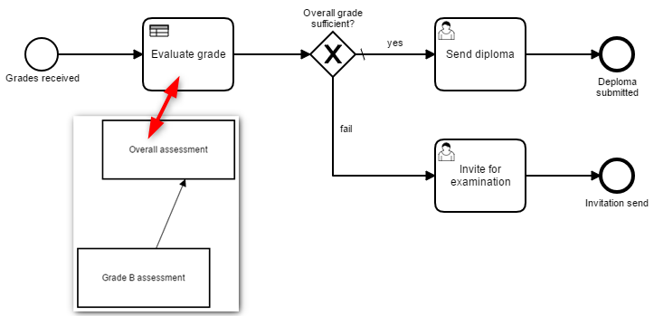
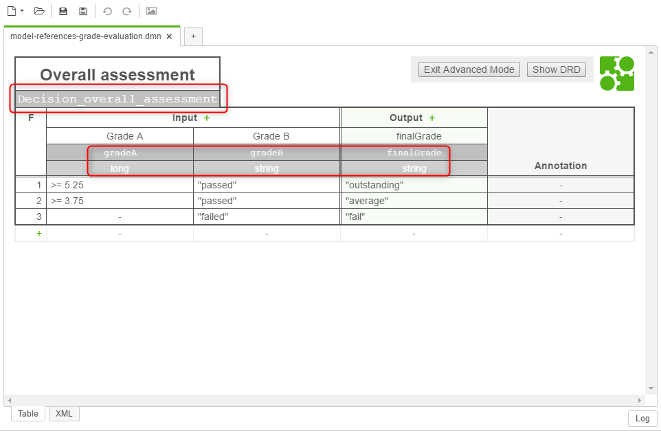

# Example: Model References

This project shows how models such as BPMN, DMN and ~~CMMN~~ can be linked.

✔ Business Rule Task ✔ Call Activity

## BPMN linking DMN

The following example shows how a DMN model,  containing a DRD and two decision tables, can be called by and embedded using a business rule task.

### Scenario

We have a fictive process where an overall grade needs to be assessed, and a decision is made whether the overall grade is sufficient or not. The assessment will be done using two grades A and B, where B consists of two sub-grades part 1 and 2. All grades are based on the Swiss grading scheme.

### Modelling of DRD and Decision Tables

The scenario mentioned above is realized using two decision tables. The association is modelled using DRD:

Decision table one is used to assess the grade B is the preceding table before assessing the overall result:

> Make sure that the variable **names** and **data types** are **consistent** with possible workflow variables (or form fields).

Decision table two does the overall assessment and takes the output (variable `gradeB`) of the preceding decision table as an input:
 

> Make sure that the variable **names** and **data types** are **consistent** with the **preceding decision table** or possible workflow variables (or form fields).

### Modelling and Linking of BPMN and DMN

## Maintainer
- [Digitalisation of Business Processes](https://github.com/digibp)

## License

- [Apache License, Version 2.0](https://github.com/DigiBP/digibp-archetype-camunda-boot/blob/master/LICENSE)